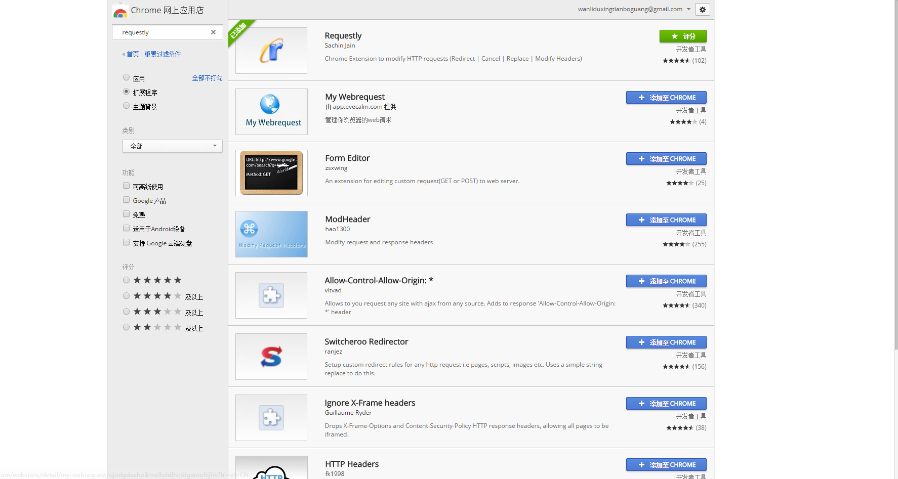
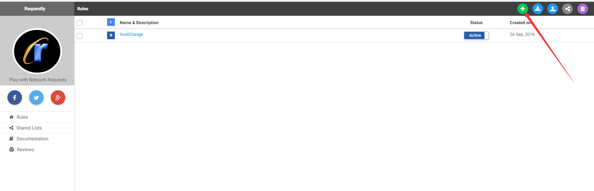
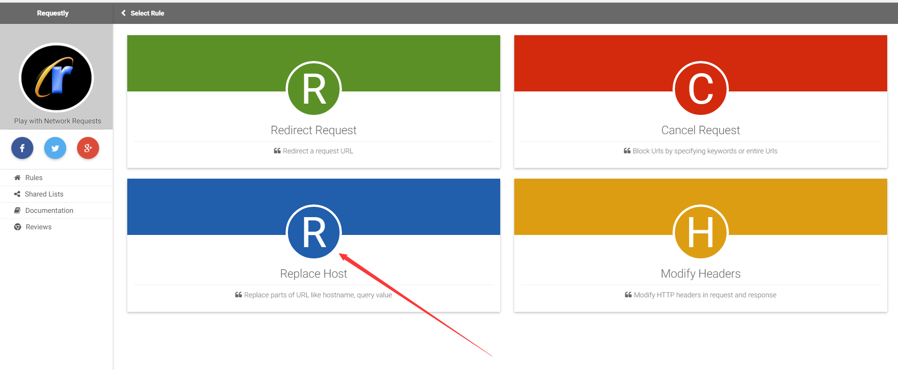
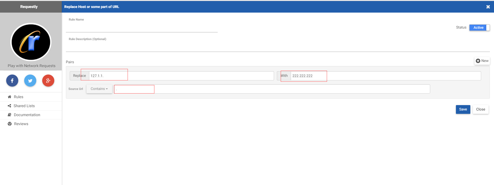

# 浏览器查看内网集群日志 #

由于服务器集群是使用内网ip搭建的，我们在spark webui中查看集群日志详情，其对应的url是以内网ip开头的，由于开发环境的浏览器和集群并不是处于同一个内网，所以浏览器无法找到对应的网址，此时我们需要浏览器帮我们进行ip跳转，以下是google浏览器对应插件，其他浏览器应该也有类似的插件

## 流程 ##

###1.下载requestly插件###

###2.打开插件，点击规则添加按钮 ###

###3.选择replace host选项

###4.在操作框添加对应的规则，如下图，我将浏览器url中包含.的所有的url中的127.1.1。都替换为222.222.222. ，即在使用工程中只要将内网的ip替换为对应的外网ip即可###

###此时在spark webui界面即可跳转到对应的日志界面###